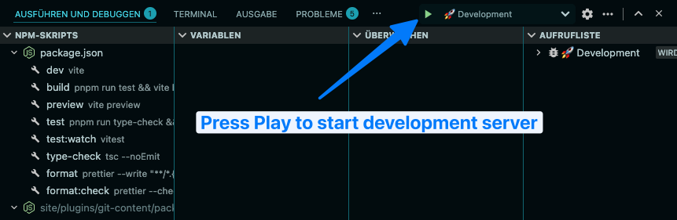

# Technikwürze

Website of the first developer podcast in Germany. This stack relies on Kirby CMS 5, Vite 5 with `vite-plugin-kirby`, and TypeScript. The content is stored in a separate Git repository for better separation of concerns and easier deployment.

## Architecture

```
Main Repository (macx/technikwuerze)
├── Code, templates, assets
└── .gitignore includes: /content

Content Repository (macx/technikwuerze-content)
├── Separate Git repository
├── Managed by kirby-git-content plugin
└── Panel changes → auto-commit → auto-push
```

## Prerequisites

- PHP 8.2+
- Composer
- Node.js 22+ (LTS)
- pnpm (via Corepack)

## Setup

Clone this repository and install dependencies:

```bash
git clone https://github.com/macx/technikwuerze.git
cd technikwuerze
composer install
corepack enable
corepack install
pnpm install
```

Corepack reads the pinned `packageManager` version from `package.json` and provides the correct pnpm version automatically.

### Content Repository

Kirby stores all content in the `content/` directory. To keep it separate from the codebase, we use a separate Git repository. When users make changes in the online Kirby Panel, like adding pages, editing content, or uploading media, those changes are commited automatically to the separate `technikwuerze-content` repository.

To pull the content upfront, clone the `technikwuerze-content` repository into the `content/` directory:

```bash
rm -rf content # if it already exists
git clone git@github.com:macx/technikwuerze-content.git content
```

### Keep content up to date

```bash
cd content
git pull origin main
```

### Use the Kirby Panel

The Kirby Panel is available at `http://localhost:8000/panel` by default. Create an account to log in and manage your content. The panel accounts are NOT in sync with the production server.

> Please note: Do not push changes directly to the `content/` repository. Always use the Kirby Panel for content changes, which ensures proper commits and synchronization.

### Local dev ports (optional)

You can override the default local host/ports for both PHP and Vite.

```bash
cp .env.example .env
```

Then edit `.env`:

```bash
DEV_HOST=localhost
DEV_PHP_PORT=8000
DEV_VITE_PORT=5173
```

VS Code tasks (`Run and Debug`) and Vite use these values automatically.

## Development (VS Code)

Use the **Run and Debug** panel in Visual Studio Code:

1. Open **Run and Debug**
2. Select `🚀 Development`
3. Click the green play button



What starts automatically:

- PHP server on `http://localhost:8000` by default (`kirby/router.php`)
- Vite dev server on `http://localhost:5173` by default (HMR assets)
- Chrome incognito window with:
  - `http://<DEV_HOST>:<DEV_PHP_PORT>/`
  - `http://<DEV_HOST>:<DEV_PHP_PORT>/panel`

> Note: The actual site runs on `DEV_PHP_PORT`. `DEV_VITE_PORT` serves Vite/HMR assets.

### Development fallback

If you prefer to start the servers manually, run the following commands in separate terminal windows:

```bash
php -S localhost:8000 kirby/router.php
pnpm run dev
```

Then open `http://localhost:8000`.

## Build and Test

```bash
pnpm run test
pnpm run build
```

## Release and Deployment

- `CI` validates PRs and pushes.
- Production deploys only from tags `v*` via workflow `Deploy From Tag`.
- Create your normal `develop` -> `main` PR with `pnpm release` (or manually in GitHub).
- Optional browser fallback: `pnpm release:open`.
- PR title/body template is stored in `.github/release-pr-body.md`.
- After merge to `main`, `Release Please` opens/updates a release PR automatically.
- Merge the release PR to create tag + GitHub Release.
- Tag creation triggers `Deploy From Tag` automatically.
- Deploy excludes are defined in `.rsyncignore`; `content/`, `media/`, `site/accounts/`, cache, and sessions are never deployed from this repo.

## Runtime Data Policy

- Content is managed in the separate `technikwuerze-content` repository.
- Audio files are centralized in `content/audio/`.
- Runtime DBs live in `content/.db/`.
- Binary runtime files (audio/sqlite) are synced with `rsync`, not Git.

## License

MIT
